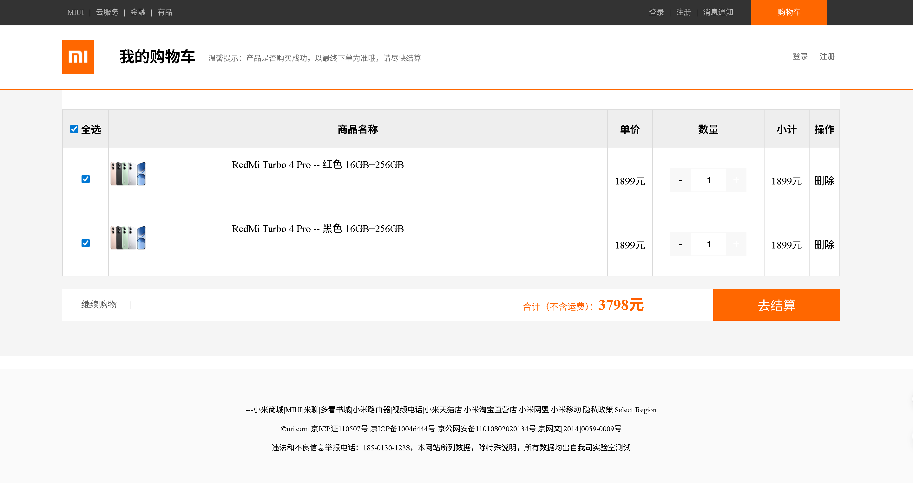

# Gin商城实战项目

## 项目介绍

Mistore是一个基于**Go语言+Gin框架**开发的现代化B2C电商系统，实现了完整的商城功能，包括商品的管理、后台管理、用户注册登录、用户购物车等核心业务模块。

## 项目截图

1. 后台管理员登录界面


2. 后台管理页面


2. 商城首页


3. 商品分类页面


4. 购物车页面



6. 用户注册


## 使用的第三方库

```shell
go get -u github.com/gin-gonic/gin
go get -u gorm.io/gorm
go get -u gorm.io/driver/mysql
go get -u github.com/mojocn/base64Captcha
go get -u github.com/go-redis/redis/v8
go get -u gopkg.in/ini.v1
go get -u github.com/google/uuid
go get -v -u github.com/hunterhug/go_image
go get -u github.com/skip2/go-qrcode
go get -u github.com/aliyun/aliyun-oss-go-sdk/oss
go get -u github.com/gomarkdown/mdtohtml
go get -u github.com/golang-jwt/jwt/v5
```
